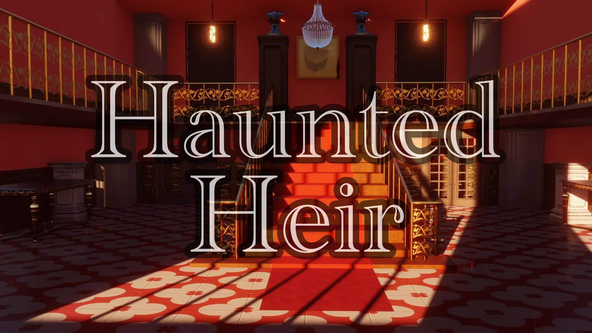

<p align="center">
  
</p>

# Haunted Heir

[](https://github.com/remarkablegames/haunted-heir/releases)
[](https://github.com/remarkablegames/haunted-heir/actions/workflows/build.yml)
[](https://github.com/remarkablegames/haunted-heir/actions/workflows/lint.yml)

🏠 You receive an inheritance letter from a fallen house. As you arrive and meet the Lord, you realize something spooky is going on...

Play the game:

- [itch.io](https://remarkablegames.itch.io/haunted-heir)
- [remarkablegames](https://remarkablegames.org/haunted-heir)

Or download:

- [Windows](https://github.com/remarkablegames/haunted-heir/releases/latest/download/win.zip)
- [Mac](https://github.com/remarkablegames/haunted-heir/releases/latest/download/mac.zip)
- [Linux](https://github.com/remarkablegames/haunted-heir/releases/latest/download/pc.zip)

Read the [blog post](https://remarkablegames.org/posts/haunted-heir/) or watch the [YouTube video](https://youtu.be/kdZLXzgPbT8).

## Credits

### Art

- [DAX](https://lunarmoonstudios.itch.io/adventures-essentials)
- [Free Game Assets](https://free-game-assets.itch.io/free-rpg-book-icons)
- [Potat0Master](https://potat0master.itch.io/free-visual-novel-backgrounds-mansion-pack)
- [Robert Brooks](https://gamedeveloperstudio.itch.io/)
- [Xiael](https://xiael.itch.io/)
- [eyeless_artist](https://eyeless-artist.itch.io/ghost-girl-vn-graphic)

### Audio

- [Kenney Interface Sounds](https://kenney.nl/assets/interface-sounds)
- [Text/Dialogue Bleeps Pack](https://dmochas-assets.itch.io/dmochas-bleeps-pack)
- Pixabay
  - [Birds chirping 04](https://pixabay.com/sound-effects/birds-chirping-04-6771/)
  - [Cash Register Purchase](https://pixabay.com/sound-effects/cash-register-purchase-87313/)
  - [Door Creek 02](https://pixabay.com/sound-effects/door-creak-02-79920/)
  - [Ghost Whispers](https://pixabay.com/sound-effects/ghost-whispers-6030/)
  - [Main Door Opening-Closing](https://pixabay.com/sound-effects/main-door-opening-closing-38280/)
  - [Mortice Door Lock being locked and unlocked](https://pixabay.com/sound-effects/mortice-door-lock-being-locked-and-unlocked-95884/)
  - [Night Ambience](https://pixabay.com/sound-effects/night-ambience-17064/)
  - [Paper turn](https://pixabay.com/sound-effects/paper-turn-40077/)
  - [Running Water Gentle Sound](https://pixabay.com/sound-effects/running-water-gentle-sound-185148/)
  - [box crash](https://pixabay.com/sound-effects/box-crash-106687/)

### Development

- [Mark](https://github.com/remarkablemark)
- [Rob Cohen](https://github.com/rmacohen)
- [TentativeTenebris](https://github.com/TentativeTenebris)
- [Verida](https://verida.itch.io/)

### Music

- [VOiD1 Gaming](https://void1gaming.itch.io/free-horror-music-pack)

### Voice

- [David Wamala](https://davidwamalava.carrd.co/) (as the Lord)
- [Rico Hatton](https://www.voiceofjessricohatton.com/) (as the Ghost)

## Ideation

- [Excalidraw](https://excalidraw.com/#json=FDEvc4r71jpkUDXUXfyKL,8NkgqD3_dHVBEEv-6jlqbQ)
- [Game Design Document](https://docs.google.com/document/d/1f7EV2XIVscNHl7_zC7w7ZSFk6rEn6_HovDL0cl7gp2s/edit)

## Prerequisites

Download [Ren'Py SDK](https://www.renpy.org/latest.html):

```sh
git clone https://github.com/remarkablegames/renpy-sdk.git
```

Symlink `renpy`:

```sh
sudo ln -sf "$(realpath renpy-sdk/renpy.sh)" /usr/local/bin/renpy
```

## Install

Clone the repository to the `Projects Directory`:

```sh
git clone https://github.com/remarkablegames/haunted-heir.git
cd haunted-heir
```

## Run

Launch the project:

```sh
renpy .
```

Or open the `Ren'Py Launcher`:

```sh
renpy
```

Press `Shift`+`R` to reload the game.

Press `Shift`+`D` to display the developer menu.

## Cache

Clear the cache:

```sh
find game -name "*.rpyc" -delete
```

Or open `Ren'Py Launcher` > `Force Recompile`:

```sh
renpy
```

## Lint

Lint the game:

```sh
renpy game lint
```
